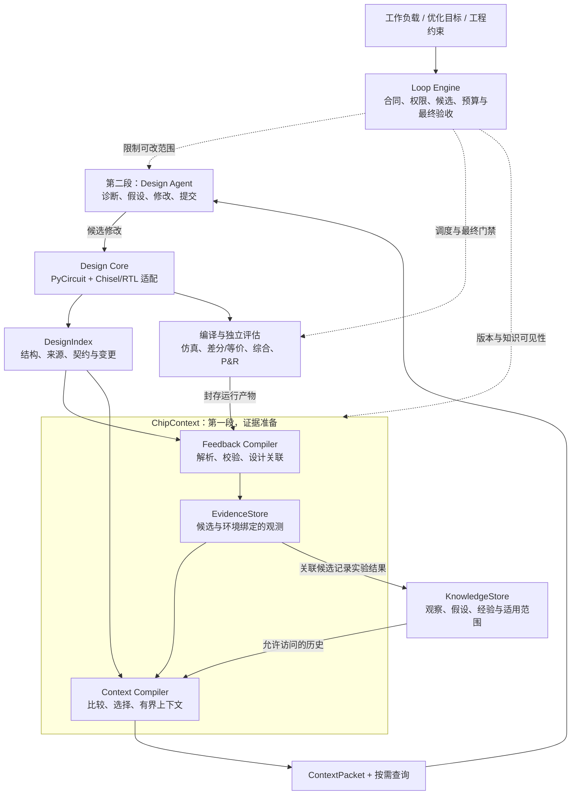

<div align="center">

<h1>Agentic Chip Design</h1>

<p><strong>让通用 Agent 更高效地完成芯片设计优化</strong></p>
<p>面向真实 AI 工作负载的设计表示、工程反馈与受控优化闭环</p>

<p>
  <a href="#项目目标">项目目标</a> ·
  <a href="#整体架构">整体架构</a> ·
  <a href="#当前进展">当前进展</a> ·
  <a href="#路线图">路线图</a> ·
  <a href="#开始了解与参与">开始参与</a> ·
  <a href="CONTRIBUTING.md">贡献指南</a>
</p>

</div>

**Agentic Chip Design** 正在建设一个模型可替换的芯片设计优化框架：连接设计语言、编译器、仿真与 EDA 工具，将可确定计算的工程信息交给程序处理，让 Agent 集中完成问题诊断、设计探索和候选修改。

我们从真实 BOOM 模块的优化实验起步，逐步建设两段式证据准备和 PyCircuit 原生设计能力，长期面向 **AI 工作负载、编译器与硬件资源的协同设计**。衡量项目价值的标准不是生成了多少 RTL，而是同一个 Agent 能否以更低的端到端成本，找到通过独立验证的更优设计。

> **项目阶段：架构规划与早期 POC。** 当前仓库公开架构文档、实验摘要、示例配置和实施任务，尚未发布可直接运行的一体化平台。下文将目标能力、已有实验记录和待验证工作分别说明。

## 项目目标

一次芯片优化不仅涉及生成代码，还需要恢复源码与生成 RTL 的关系、定位时序路径、理解验证失败、比较不同候选，并在正确性和工程预算内决定下一步实验。

本项目的核心思路是：**把 Agent 每轮反复恢复的工程事实，转化为可查询、可追溯、可检查的计算结果，再将模型推理用于真正的设计决策。**

近期先验证 RTL/模块级优化的效率；中期让 PyCircuit 成为原生设计核心；长期连接 AI 业务负载与基础设施需求，将优化范围扩展到编译器映射、硬件资源和架构选择。BOOM 是方法验证载体，而不是项目的最终范围。

```text
AI 工作负载与工程目标
        ↓
编译器与软硬件映射
        ↓
架构选择与硬件设计
        ↓
仿真、正确性与物理实现反馈
        └────────→ 下一轮设计决策
```

我们研究的是 **同模型条件下的环境增益**，不以领域模型后训练为本阶段核心，也不重新实现仿真、形式验证、综合或布局布线求解器。

## 核心设计

以下是指导架构与实现的五项设计原则；各项的当前状态见[当前进展](#当前进展)。

| 设计原则 | 规划能力 | 希望解决的问题 |
|---|---|---|
| **模型与运行时可替换** | 通过薄适配层连接模型、会话与工具，领域数据不绑定单一 runtime | 保持实验可比性，持续利用通用模型进步 |
| **PyCircuit 原生设计** | 从设计构建过程中派生结构、来源关联、契约和局部检查入口 | 减少从生成 RTL 反向恢复设计语义的工作 |
| **两段式证据准备** | 先解析、校验、关联和选择工程数据，再交给优化 Agent；保留按需下钻 | 降低重复读取与无关上下文成本 |
| **独立验证与受控搜索** | 冻结目标和权限，管理候选、预算、分阶段评估及最终验收 | 防止指标漂移，不让 Agent 自行认证正确性或收益 |
| **可追溯的经验复用** | 分开保存观察、假设、修改、实验与结果，按任务控制知识可见性 | 复用有效经验，同时避免猜测污染与目标答案泄漏 |

## 整体架构

目标架构由 **Design Core、ChipContext、Loop Engine、KnowledgeStore** 四个领域模块构成，复用外部 Agent runtime 和现有工程工具。模块表示责任边界，第一版不要求微服务或复杂图数据库。



### 四个核心模块

| 模块 | 主要职责 | 关键产物 / 接口 | 深入阅读 |
|---|---|---|---|
| **Design Core** | 管理可编辑设计，派生 IR/RTL、来源索引和检查入口 | `DesignSnapshot`、`DesignIndex`、候选设计 | [PyCircuit 路线](docs/pycircuit.md) |
| **ChipContext** | 将原始工程产物转换为带来源的证据，选择当前决策所需信息 | `EvidenceSnapshot`、`ContextPacket`、下钻查询 | [证据准备](docs/chipcontext.md) |
| **Loop Engine** | 执行任务合同，隔离候选，调用评估工具并控制接受与停止 | `OptimizationContract`、`EvaluationManifest`、候选谱系 | [总体架构](docs/architecture.md) |
| **KnowledgeStore** | 保存实验经验与适用边界，管理检索、知识隔离及经验提升 | `DesignEpisode`、可见知识清单 | [数据契约](docs/data-contracts.md) |

设计事实、运行证据和历史经验分开保存。动态 slack、面积和仿真统计不写入规范性设计语义；Agent 的假设不等同于工具已经证明的结论；`ContextPacket` 是可重建的决策视图，不是另一份测量真值。

### 一次优化如何进行

**第一段：准备证据。** 控制器完成基线或候选评估后，封存原始产物。ChipContext 解析新增结果、校验候选和环境归属、关联设计版本，并计算可比条件下的变化。模型调用前再按清单和上下文预算选择数据，不重复扫描整份日志。

**第二段：分析与修改。** Design Agent 优先分析整理后的证据，需要时查询完整路径、相关设计或原始失败；随后提出假设，在允许范围内修改设计并提交候选。

**独立验收：进入下一轮或交付。** Loop Engine 调用局部检查和分阶段评估。搜索阶段通过只代表晋级，只有满足冻结的最终门禁才接受候选。Agent 不能修改参考设计、测试、约束和评分器来获得收益。

在快循环之外，跨任务经验可以经过复验与人工审核，形成新的诊断、信息清单或通用操作提案；正式实验运行期间不自动改变这些规则。

### PyCircuit、DSH 与现有工具如何协作

**PyCircuit 是未来设计核心，不只是输出语法。** 我们计划让它同时承担设计修改对象和设计事实生产者：优先建设源码–IR–RTL 来源关联、依赖与修改影响查询、结构化诊断，以及带独立参考的局部验证。近期保留 Chisel/RTL，先完成一个不改变原算法的局部等价移植，再测量原生表示的增量。ACIR 的资源与调度建模留给后续架构探索，不默认等价于现有 RTL 的精确周期行为。

**DSH 是拟选的 Agent 运行载体，不是验收权威。** 薄适配器负责上下文交付、工具调用与会话衔接；数据准备、证据和验收规则留在领域模块中。现有 CHIA/Ray/脚本承载工程任务执行，Verilator/Vivado 等工具提供验证与物理反馈。更换 runtime 不应改变实验合同，也不能把当前 BOOM 结果归因于尚未接入的 DSH。

详细分工见[历史架构映射](docs/architecture.md)、[DSH 接入规划](docs/dsh-integration.md)和[团队对齐](docs/team-alignment.md)。

## 当前进展

**状态快照：2026-09-23。** “已有实验记录”不表示对应实现已在本仓库公开；“规划”不表示已完成集成。

| 工作方向 | 当前状态 | 接下来验证什么 |
|---|---|---|
| 项目架构与协作 | 已整理总体架构、数据契约、6 份 ADR 草案和 16 项待办 | 团队评审、合同冻结与任务拆解 |
| BOOM 优化闭环 | 已有 DeepSeek 自主修改、失败恢复、独立评估与回归的实验记录；公开聚合摘要 | 补齐可审计证据，进行独立搜索重复和强基线对照 |
| 通用过程知识 | K0/K1/K2 实验出现初步效率信号 | 区分知识内容、交付方式与跨目标迁移效果 |
| 两段式反馈与 DSH | 接口、清单和薄适配方案处于规划阶段 | 实现数据准备与交付，单独测量其效率增量 |
| PyCircuit 原生设计 | 局部等价接入、DesignIndex 和验证入口处于规划阶段 | 先验证迁移正确性，再比较表示与反馈的作用 |
| 工作负载驱动的协同设计 | 长期方向 | 在前述机制验证后，扩展软件操作到硬件资源的映射 |

### BOOM 阶段验证

现有实验比较三种知识条件：**K0** 无历史知识、但可使用源码/RTL/时序和评估工具；**K1** 增加不含当前目标历史解法的通用过程知识；**K2** 可读取同目标历史，仅用于衡量方案复用。

| K1 相对 K0 的观察 | 结果 | 解读 |
|---|---|---|
| 固定 24 回合的总 token | 减少 **32.96%** | 出现 token 节约信号；总 token 含缓存命中，不等同实际费用 |
| 固定 24 回合的搜索墙钟 | 增加 **6.60%** | 尚未证明固定预算搜索整体更快 |
| 事后重放至首个搜索有效点 | token 减少 **46.83%**；搜索时间减少 **44.65%** | 阈值为功能/面积通过且后综合延迟改善至少 20%；不是正式早停或端到端交付结果 |

上述数据来自项目方提供的单次配对实验记录，本仓库未重新运行 EDA。结果仅涉及指定 FPGA 模块级验证与面积/时序，不能外推 ASIC、整核性能或功耗。**自动运行证据清洗、DSH 和 PyCircuit 的独立收益仍待验证。** 完整公开数据与限制见 [BOOM v2 阶段评审](experiments/boom-v2/README.md)。

### 如何衡量真正的进步

主指标是 **从同一起点到首个通过最终门禁、达到目标 QoR 的设计所需时间 `T_delivery`**，计入准备、模型、查询、构建、EDA、排队、最终验证和人工介入。并行执行测实际端到端墙钟，另记各阶段成本，不重复相加。

同时报告固定预算最佳已验证 QoR、成功率、token/实际费用、EDA 计算量与 P&R 次数。以**专家 Prompt + Agent 自写脚本**作为强基线，分别消融知识、反馈、设计表示和运行时；不能仅比较一个弱提示词，也不能只统计成功样本。见[评估协议](docs/evaluation.md)。

## 路线图

按可检查的交付与证据推进，不预先承诺工期或性能提升。

| 阶段 | 核心交付 | 完成判据 |
|---|---|---|
| **M0 · 合同与强基线** | 冻结目标、最终门禁、成本和知识边界；补齐候选审计 | 候选可追到输入、补丁与结果，强基线可重跑 |
| **M1 · 两段式证据准备** | 确定性 Extractor、清单选择、ContextPacket 与薄 runtime 适配 | 通过数据归属/缺失/恢复测试，并完成与原始工具的效率对照 |
| **M2 · PyCircuit 接入资格** | 一个局部等价模块、独立参考与 DesignIndex | 不改变原算法即可通过局部及集成验证，迁移成本/PPA 单列 |
| **M3 · 表示与反馈增量** | 来源查询、局部诊断、反例重放及 2×2 消融 | 分离语言与反馈的作用，在留出模块上验证效果 |
| **M4 · 经验与范围扩展** | 跨目标 Episode、受控经验提升与 workload 映射试点 | 迁移收益成立，通用工具改进经过审核 |

M1 与小范围 M2 可以并行。近期不整体重写 BOOM、不默认扩容多 Agent，也不让系统自动修改正式验收规则。阶段与依赖见 [ROADMAP](ROADMAP.md) 和 [BACKLOG](tracking/BACKLOG.md)。M0–M4 是规划阶段，ACD 编号是本地任务 ID，不代表已创建对应 GitHub Milestone 或 Issue。

## 开始了解与参与

当前仓库的入口是架构、实验与实施计划，而不是安装包。克隆后即可阅读和参与文档评审；**仅克隆本仓库不能运行完整 BOOM 实验或一体化优化平台。**

```bash
git clone https://github.com/TaoTao-real/agentic-chip-design.git
cd agentic-chip-design
```

| 你的目标 | 建议入口 |
|---|---|
| 理解项目、与团队对齐 | [团队对齐](docs/team-alignment.md) → [整体架构](docs/architecture.md) |
| 实现数据准备与 Agent 接入 | [ChipContext](docs/chipcontext.md) → [数据契约](docs/data-contracts.md) → [DSH 适配](docs/dsh-integration.md) |
| 参与 PyCircuit 与编译器工作 | [PyCircuit 路线](docs/pycircuit.md) → [表示与反馈消融](docs/evaluation.md) |
| 审视实验结论或设计新实验 | [BOOM v2 摘要](experiments/boom-v2/README.md) → [评估协议](docs/evaluation.md) |
| 领取任务或讨论架构决策 | [任务清单](tracking/BACKLOG.md) → [ADR 草案](docs/adr/README.md) → [Issues](https://github.com/TaoTao-real/agentic-chip-design/issues) |

信息清单的起点见 [`configs/evidence-policy.example.json`](configs/evidence-policy.example.json)；它是领域策略示例，不是已经可执行的 DSH 插件配置。讨论脉络见[设计演进](docs/discussion-map.md)。

## 贡献与协作

欢迎围绕 **Agent/上下文、PyCircuit/编译器、验证/实验** 三个方向参与。通过 Issue 明确问题、依赖与验收，通过 PR 提交文档或实现；涉及职责和合同的变化先进行 ADR 评审。

请先阅读 [CONTRIBUTING](CONTRIBUTING.md) 和 [AGENTS](AGENTS.md)。实验贡献需要明确同模型、同任务、同预算下改变了哪个因素，同时报告失败、准备成本与未验证的边界；尚未实现或运行的能力不标为完成。

## 资料与许可

本仓库公开整理后的架构、方法、聚合实验摘要和任务，不包含原始完整会话、候选补丁、凭据、受限 PDK 或完整 EDA 产物。资料来源与公开范围见 [sources](sources/README.md) 和[发布说明](docs/publication.md)。外部论文与工具主张另行维护[核验清单](docs/references-to-verify.md)，不将历史讨论当作已验证事实。

**规划仓库不是盲测 Agent 的默认知识库。** 实验需隔离工作区和知识可见性，避免历史答案污染；具体规则见 [SECURITY](SECURITY.md)。

当前尚未选择开源许可证；公开可读不等于授予开源使用许可。详见 [LICENSE_STATUS](LICENSE_STATUS.md)。
