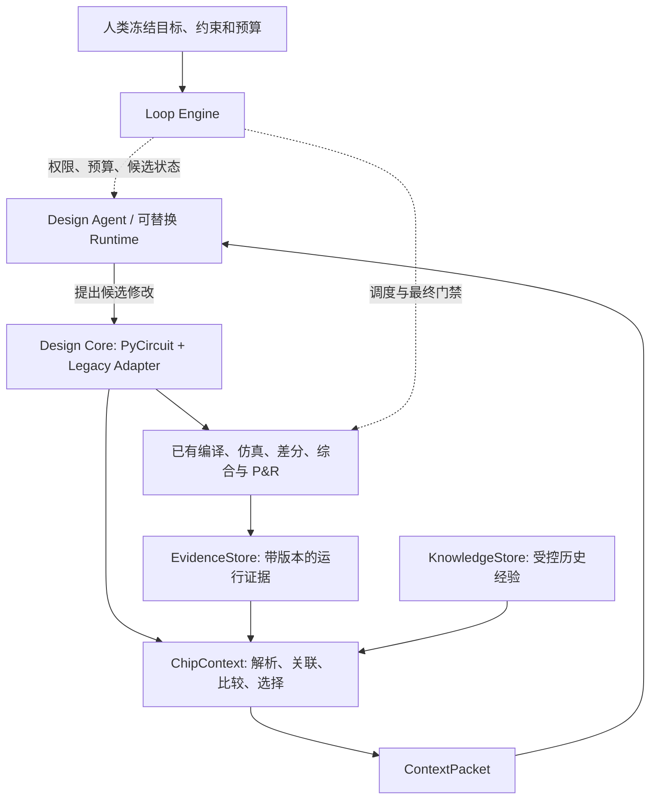

# agentic-chip-design

> 让同一个通用 Agent，以更低的端到端成本，交付通过独立验证的更优芯片设计。

**状态：研究规划与实验跟踪仓库。目标架构、接口与 ADR 是提案，不代表平台或 DSH/PyCircuit 插件已经完成。**

本仓库将项目讨论整理为可维护的工程文档，不是完整聊天记录，也不恢复缺失回复的原文。初始化日期：2026-09-23。

## 阅读入口

| 目的 | 文档 |
|---|---|
| 与领导同事对齐 | [团队对齐](docs/team-alignment.md) |
| 理解目标架构与历史映射 | [架构](docs/architecture.md) / [讨论演进](docs/discussion-map.md) |
| 实施两段式反馈 | [ChipContext](docs/chipcontext.md) / [DSH 薄适配](docs/dsh-integration.md) |
| 将 PyCircuit 作为设计核心 | [PyCircuit 路线](docs/pycircuit.md) |
| 固定领域接口 | [数据契约](docs/data-contracts.md) |
| 查看阶段实验判断 | [BOOM v2 摘要及边界](experiments/boom-v2/README.md) |
| 验证是否优于专家 Prompt | [消融协议](docs/evaluation.md) |
| 跟踪执行 | [路线图](ROADMAP.md) / [16 项待办](tracking/BACKLOG.md) / [GitHub Issues](https://github.com/TaoTao-real/agentic-chip-design/issues) |
| 审核架构决策 | [6 份 ADR 草案](docs/adr/README.md) |
| 了解公开范围 | [发布说明](docs/publication.md) / [资料依据](sources/README.md) |

## 项目边界

研究可替换模型的工程环境，不以领域后训练为本阶段核心；复用已有仿真、验证、综合和布局工具，不重造求解器。未来以 PyCircuit 为原生设计核心，近期兼容 Chisel/RTL，先做局部等价接入。

**第一段准备证据；第二段 Agent 分析修改；Loop Engine 控制预算、独立评估和验收。**

以上是目标设计。DSH 是拟选运行载体，不是测量或验收权威；领域状态与接口不绑定特定 runtime。

## 当前证据

来自项目方提供的 BOOM v2 实验记录，**本仓库没有重新运行或独立复现 EDA**。公开摘要不替代原始证据包。

| 比较 | 报告观察 | 必须保留的限制 |
|---|---|---|
| K1 对 K0，固定 24 回合 | 总 token 少 32.96%，搜索墙钟多 6.60% | 不能说整体搜索更快 |
| 事后统一搜索阈值重放 | 首个搜索有效点 token 少 46.83%，时间少 44.65% | 不是正式早停或端到端最终交付结果 |
| 后布线延迟 | K0 21.999 ns；K1 21.262 ns；K2 22.055 ns | 指定 FPGA 模块级结果，不外推整机、ASIC 或功耗 |
| K2 | 可读取同目标历史 | 衡量复用，不证明从零发现 |

当前主要是通用过程知识的单次配对信号；自动运行证据清洗、DSH 交付和 PyCircuit 的独立收益仍待验证。详见 [阶段评审](experiments/boom-v2/README.md)。

## 路线

M0 合同与强基线 → M1 两段式证据准备 → M2 PyCircuit 局部等价接入 → M3 表示×反馈消融 → M4 跨目标经验与 workload 映射。M1 与小范围 M2 可并行，大规模迁移等待证据。

## 公开与使用边界

当前远端为公开仓库。本次仅发布整理后的架构、方法、聚合实验摘要与任务；不上传原始实验包、完整会话、账号/机器信息、候选补丁、目标专用解法、密钥、PDK 或完整 EDA 产物。未擅自选择开源许可证，见 [LICENSE_STATUS](LICENSE_STATUS.md)。

规划仓库不是盲测 Agent 的默认知识库。即使不含具体补丁，也可能透露任务结构和实验目标；盲测需隔离工作区与知识可见性。参见 [SECURITY](SECURITY.md) 和 [AGENTS](AGENTS.md)。
